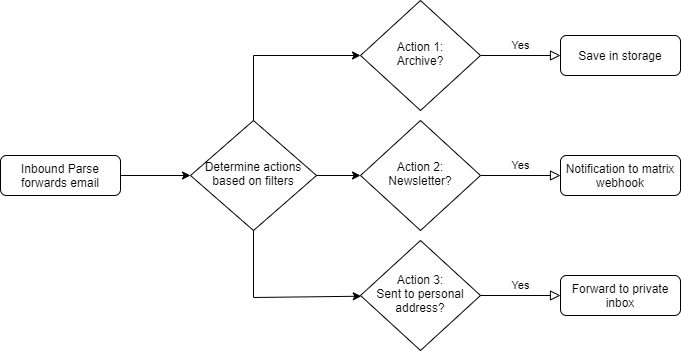

# Sendgrid based email receiver for incoming email (with fanout support)

I have built multiple solutions that parse incoming emails to perform actions (using the [Sendgrid Inbound Parse feature](https://sendgrid.com/docs/for-developers/parsing-email/inbound-email/)):

- [email-bug-tracker](https://github.com/MarcStan/email-bug-tracker) - Creates bug entries in Azure DevOps based on specially crafted emails
- [email-relay](https://github.com/MarcStan/email-relay) - Allows sending/receiving emails from your domains by (ab)using the SendGrid Inbound Parse feature (although now largely replaced by this function and its [Email action](docs/Supported%20actions.md#Email))
- matrix-email-bot - Forwards emails based on filter criteria to a [matrix room](https://matrix.org/try-now/) (to be opensourced in the future)

# Problem

Each service separately listens for incoming emails via Sendgrid Inbound Parse but only one of these services can run on a domain at any point in time as sendgrid only allows one webhook per (sub)domain.

My current workaround is to use a subdomain for each to set them all up individually (e.g. `<recipient>@example.com`, `<recipient>@bugs.example.com` & `<recipient>.matrix@example.com`).

Even if it where possible to set multiple Inbound Parse webhooks on a single domain I would have to adjust all my functions since they all rely on specific formats (bug tracker expects a different format than the matrix bot and would likely crash on unrecognized format, etc.).

# Solution

To receive emails on a single domain/address with all these services I built this Azure function based filtering & forwarding system that can fanout emails based on filters.

The function allows defining simple filters (much like a regular rule engine in email clients) and can forward email to other webhooks (such as the ones mentioned before).

This allows me to receive all emails via this function and have it forward the email to the respective sub systems based on filters where necessary.

E.g. I can easily filter for `sender equals <me> AND recipient equals bugs@<domain>` and only forward such emails to the [email-bug-tracker](https://github.com/MarcStan/email-bug-tracker) whereas other mails are forwarded to other subsystems.

See [Examples](docs/Examples.md) for more details.

# Features

* forward emails to a separate inbox and easily reply to them
* filtering & forwarding of emails to multiple webhooks/targets based on a simple rule engine
* retry & failsafe to guarantee delivery to each webhook/target
  * built on top of the Sendgrid [retry mechanism](https://sendgrid.com/docs/API_Reference/SMTP_API/errors_and_troubleshooting.html) (retry for 72 hours when error codes are received)
* multiple supported targets and formats (webhook, storage account)

See [Fault tolerance](docs/Fault%20tolerance.md) for more details on retry behaviour.

# Known issues

* attachment names with [non ascii characters are wrongly encoded if sent via sendgrid](https://github.com/sendgrid/sendgrid-go/issues/362) (the content is always correctly encoded, though)

# Setup

You must first setup a Sendgrid account and connect your domain (make sure that Sendgrid is able to send emails on behalf of your domain).

You can follow [their documentation](https://sendgrid.com/docs/ui/account-and-settings/how-to-set-up-domain-authentication/) to setup domain authentication.

Deployment is fully automated via Github actions. Just [setup credentials](https://github.com/marketplace/actions/azure-login#configure-azure-credentials), adjust the variables at the start of the yaml file (resourcegroup name) and run the action.

See [Setup](docs/Setup.md) for more details.

:warning: When setting mx record of your root domain to sendgrid **all** emails will be relayed through sendgrid. If you have a regular mail client, **it will no longer receive emails!**

Additionally sendgrid free tier is limited to 100 mails per day (25000 mails per month if you signup via Azure) if this is not enough for you, consider a regular email service or the paid sendgrid plans.

You can also chose to only enable this system on a subdomain (e.g. foo.example.com) but then only emails of that subdomain will be received (e.g. bar@foo.example.com).

# Examples

See [Examples](docs/Examples.md) for my personal usecases.

# Testing

Once the azure function is hooked up, all you have to do is send an email to your domain.

The email should then be stored in the storage account or relayed to the target webhooks (depending on your setup) within ~10 seconds.
